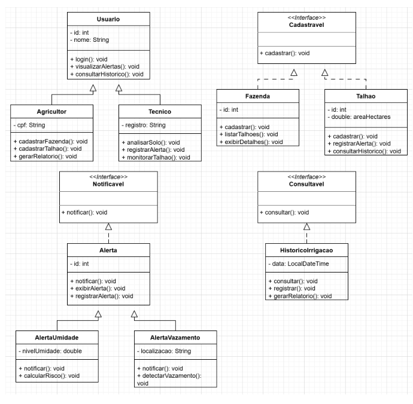

# 🌱 AgroSat Water

Sistema de gerenciamento hídrico agrícola desenvolvido em **Java**, utilizando conceitos de **DDD (Domain-Driven Design)**, **interfaces**, **herança** e **polimorfismo** para simular o monitoramento de umidade do solo via sensoriamento remoto por satélite (SAR).

> Projeto acadêmico desenvolvido para a disciplina de **Domain Driven Design Using Java** — FIAP, curso de Análise e Desenvolvimento de Sistemas, como parte do desafio **Global Solution 2026 — Space Connect**.

---

## 📌 Sobre o Projeto

O **AgroSat Water** propõe uma solução tecnológica para um dos maiores desafios do agronegócio: o **desperdício de água por irrigação ineficiente**. O agronegócio responde por aproximadamente 70% do consumo hídrico mundial, e sistemas de irrigação tradicionais costumam operar de forma padronizada, sem considerar as variações reais de umidade ao longo da propriedade.

A solução utiliza sensores de micro-ondas **SAR (Synthetic Aperture Radar)** para captar a **permissividade dielétrica do solo** — quanto maior a umidade presente, maior a permissividade captada pelo satélite. Com esses dados, a plataforma permite:

- Cadastro e gerenciamento de **fazendas** e **talhões**;
- Gerenciamento de **usuários** (agricultores e técnicos);
- Registro e visualização de **alertas de umidade**;
- Registro de **alertas de vazamento ou seca**;
- Consulta ao **histórico de irrigações**;
- Geração de relatórios para apoiar decisões de manejo hídrico.

---

## 🎯 Objetivos

- Permitir o cadastro e gerenciamento de fazendas e talhões;
- Gerenciar os diferentes perfis de usuários da plataforma;
- Registrar e visualizar alertas de umidade, vazamento ou seca;
- Consultar o histórico de irrigações da propriedade;
- Fornecer dados concretos para embasar decisões de manejo agrícola;
- Contribuir para o uso responsável dos recursos hídricos sem comprometer a produtividade.

---

## 🧩 Arquitetura e Modelagem

O domínio do sistema foi modelado em classes que representam as entidades centrais do negócio agrícola: fazendas, talhões, usuários, alertas e histórico de irrigação. A solução aplica **interfaces** para definir contratos de comportamento comuns entre classes distintas, e **herança** para reaproveitar características entre entidades relacionadas.

### Interfaces

| Interface | Responsabilidade | Implementada por |
|---|---|---|
| `Cadastravel` | Define o contrato `cadastrar()` para entidades que podem ser registradas no sistema | `Fazenda`, `Talhao` |
| `Notificavel` | Define o contrato `notificar()` para entidades que emitem notificações | `Alerta` (e subclasses) |
| `Consultavel` | Define o contrato `consultar()` para entidades que podem ser consultadas | `HistoricoIrrigacao` |

### Hierarquia de Classes

**Usuario** centraliza os atributos e métodos comuns (`id`, `nome`, `login()`, `visualizarAlertas()`, `consultarHistorico()`), enquanto **Agricultor** e **Tecnico** especializam o comportamento — o agricultor cadastra fazendas/talhões e gera relatórios; o técnico analisa o solo, registra alertas e monitora talhões.

**Alerta** centraliza o comportamento comum de notificação, enquanto **AlertaUmidade** e **AlertaVazamento** implementam suas regras específicas de risco e detecção.

### Diagrama de Classes (UML)



> 📎 Diagrama modelado no draw.io, representando a hierarquia de classes, interfaces e relacionamentos do sistema.

---

## ⚙️ Funcionalidades Detalhadas

### 1. Cadastrar Fazenda e Talhão
Método `cadastrar()`, implementado pela interface `Cadastravel`. Solicita ao usuário o nome da fazenda e a área do talhão (em hectares), confirmando cada etapa do cadastro com mensagens de sucesso via `JOptionPane`.

### 2. Registrar Alerta de Umidade
Método `calcularRisco()` da classe `AlertaUmidade`. Analisa o nível de umidade do solo captado e classifica o risco hídrico da área:

- **< 30%** → Risco **ALTO** — solo muito seco;
- **> 80%** → Alerta de **solo encharcado**;
- **Entre 30% e 80%** → Nível **adequado**.

### 3. Registrar Alerta de Vazamento ou Seca
Método `detectarVazamento()` da classe `AlertaVazamento`. Identifica e registra um vazamento no sistema de irrigação, exibindo a localização detectada e orientando o acionamento da equipe de manutenção.

### 4. Consultar Histórico de Irrigações
Método `consultar()` da classe `HistoricoIrrigacao`, implementado pela interface `Consultavel`. Exibe a data e hora da última irrigação registrada, permitindo ao agricultor acompanhar o histórico de manejo hídrico, além de gerar um relatório resumido.

---

## 🖥️ Interface

O sistema utiliza **`JOptionPane`** para toda a interação com o usuário (inputs e mensagens de confirmação), simulando um fluxo de uso real através de caixas de diálogo:

- Cadastro de fazenda e talhão;
- Alertas de umidade com classificação de risco;
- Alertas de vazamento com localização;
- Histórico de irrigação e geração de relatório.

---

## 🚀 Como Executar

### Pré-requisitos
- [JDK 17+](https://www.oracle.com/java/technologies/downloads/) instalado;
- IDE de sua preferência (IntelliJ, Eclipse, VS Code) ou apenas o terminal.

### Passo a passo

```bash
# Clone o repositório
git clone https://github.com/<seu-usuario>/agrosat-water-java.git
cd agrosat-water-java

# Compile o projeto
javac *.java

# Execute a aplicação
java Main
```

> Ajuste o nome da classe principal caso o ponto de entrada não seja `Main`.

---

## 📁 Estrutura do Projeto

```
agrosat-water-java/
├── Usuario.java
├── Agricultor.java
├── Tecnico.java
├── Fazenda.java
├── Talhao.java
├── Alerta.java
├── AlertaUmidade.java
├── AlertaVazamento.java
├── HistoricoIrrigacao.java
├── Cadastravel.java        (interface)
├── Notificavel.java        (interface)
├── Consultavel.java        (interface)
├── Main.java
├── DiagramaAgroSatWater.png
└── README.md
```

---

## 🛠️ Tecnologias Utilizadas

- **Java** (orientação a objetos, interfaces, herança, polimorfismo)
- **Swing (`JOptionPane`)** para interface gráfica simplificada
- **draw.io** para modelagem do diagrama de classes (UML)

---

**FIAP — Análise e Desenvolvimento de Sistemas**
Global Solution 2026 — Tema: *Space Connect*

---

## 📄 Licença

Projeto acadêmico desenvolvido para fins educacionais na disciplina de Java da FIAP.
